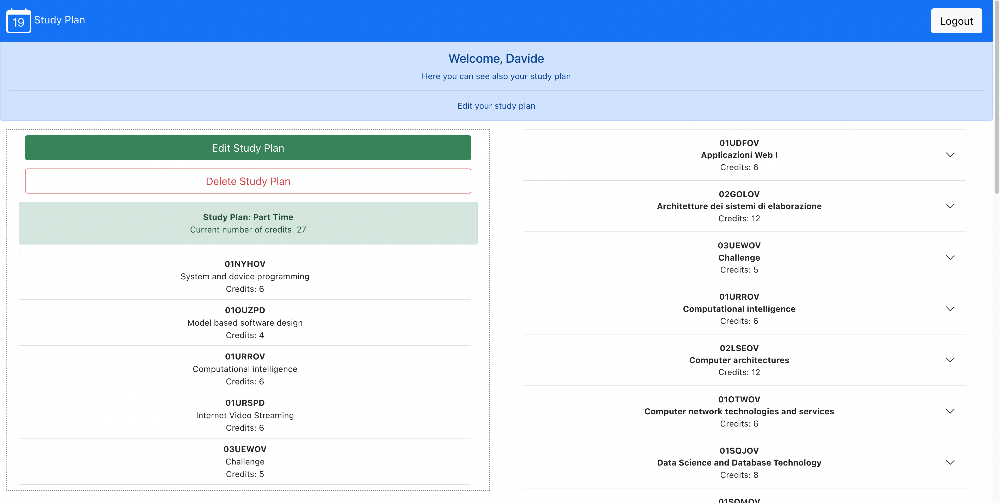
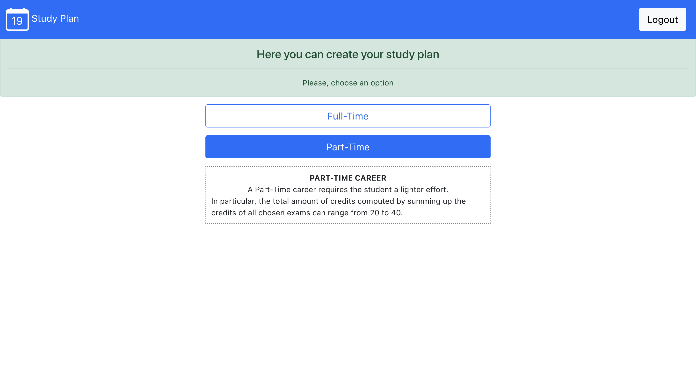
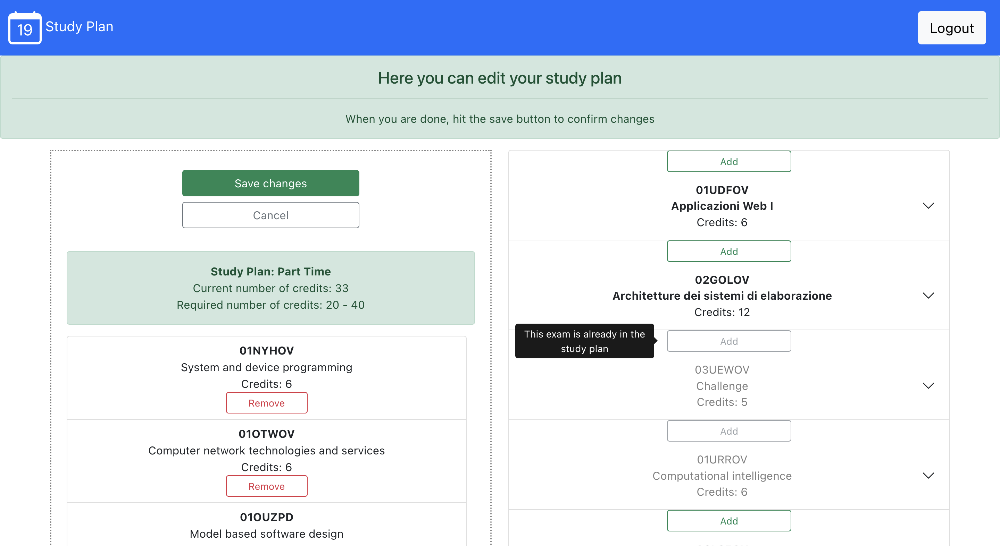
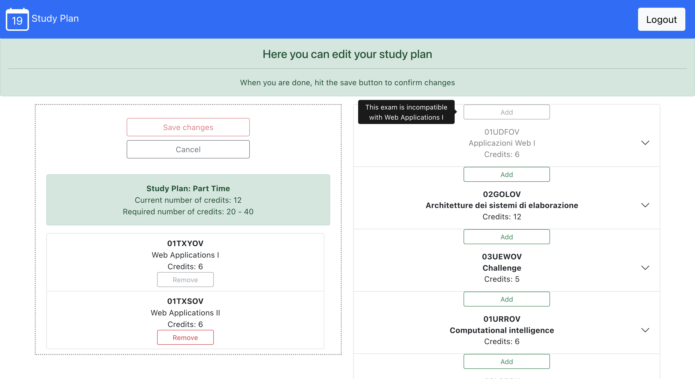
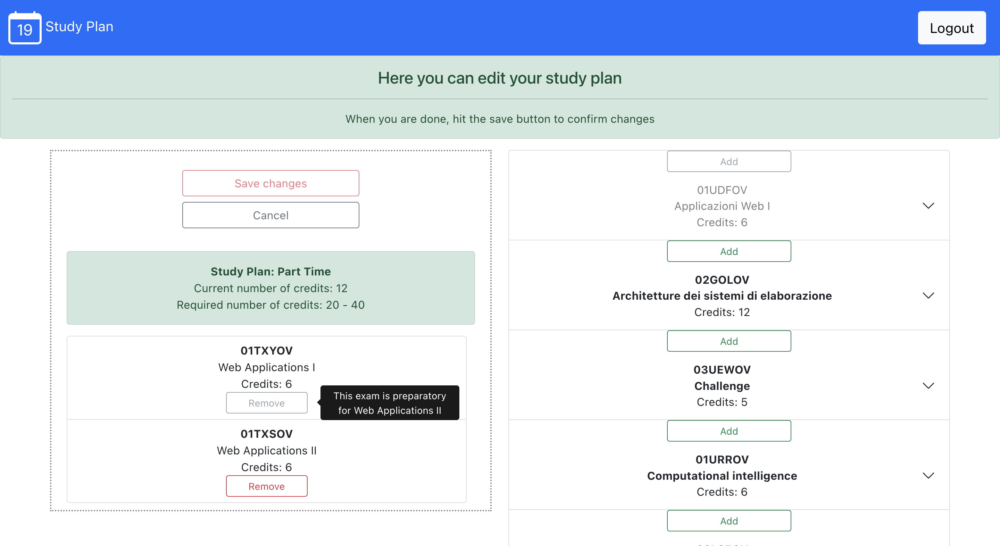
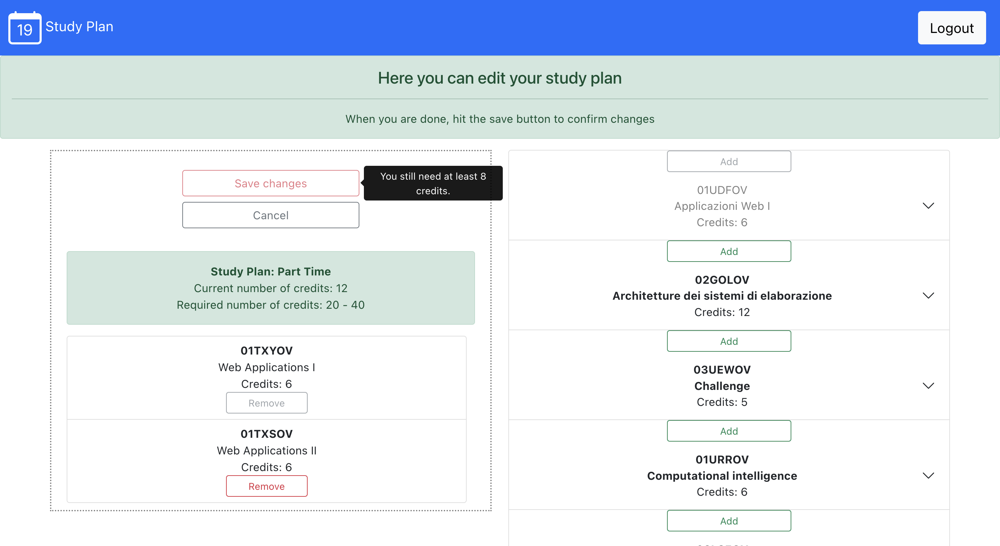

# Exam #1: "StudyPlan"
## Student: s295229 ARCOLINI DAVIDE

## React Client Application Routes

- **Route `/`** 
  It is the entry point of the web application and it renders the `<HomePage />` component. The `<HomePage />` component shows to the user the home page of the web application rendering the navigation bar, the greeting messages and the whole list of available exams. If the user is **logged in**, it renders also the study plan associated to that student.
- **Route `/login`**
  When the user clicks the login button in the navigation bar, he is redirected to this route. It renders the `<LoginPage />` component, which contains the login form the user compile to log in the web application.
- **Route `/studyplan`**
  When the user clicks the edit/create button in the home page, he is redirected to this route. It renders almost the same components of the home page, except that the study plan is now editable.
- **Route `*`**
  It matches all the other routes, indicating to the user that the requested page does not exists.

## API Server
### Exams API
- **API: `GET /exams`**
\
    `GET /api/exams`
    Retrieve the list of all the available exams.
    - **Request body** is empty.
    - **Response**: `200 OK` (success). Return a list of JSON objects, containing all the exams stored in the Database. The **response body** has the following structure:  
    ```JSON
    [
        {
            "code": "01UDFOV",
            "name": "Applicazioni Web I", 
            "credits": 6,
            "capacity": "null",
            "currentStudentsNumber": 0,
            "preparatory": null,
            "incompatible": "01TXYOV"
        },

        {
            "code": "02GOLOV",
            "name": "Architetture dei sistemi di elaborazione", 
            "credits": 12,
            "capacity": "null",
            "currentStudentsNumber": 0,
            "preparatory": null,
            "incompatible": "02LSEOV"
        },

        ...
    ]
    ```
    - **Error responses**: 
        - `422 UNPROCESSABLE ENTITY` (the request is not in the specified format)
        - `500 INTERNAL SERVER ERROR` (generic error if the server crashes)    
---
- **API: `GET /api/exams/:code`**
\
    `GET /api/exams/:code`
    Retrieve the exam whose code corresponds to the given code.
    - **Request body** is empty.
    - **Params** contains the code of the exam.
    - **Response**: `200 OK` (success). Return a JSON object, containing the specific exam stored in the Database. The **response body** has the following structure:  
    ```JSON

    {
        "code": "01UDFOV",
        "name": "Applicazioni Web I", 
        "credits": 6,
        "capacity": "null",
        "currentStudentsNumber": 0,
        "preparatory": null,
        "incompatible": "01TXYOV"
    }
    ```
    - **Error responses**: 
      - `404 Not Found` (the object cannot be found in the database)
      - `422 UNPROCESSABLE ENTITY` (the request is not in the specified format)
      - `500 INTERNAL SERVER ERROR` (generic error if the server crashes)    

### Student API
- **API: `POST /api/student/session`**
\
    `POST /api/student/session`
    Attempt to log in the user, given its credentials.
    - **Request body** contains the username and password of the student.
    - **Response**: `201 Created` (the user has been successfully authenticated). The **request body** has the following structure:  
    ```JSON

    {
        "username": "davide.arcolini@studenti.darkmagic.it",
        "password": "supersecurepassword" 
    }
    ```
    - **Error responses**: 
      - `401 NOT AUTHORIZED` (the credentials to log in are not correct)
      - `422 UNPROCESSABLE ENTITY` (the request is not in the specified format)
      - `500 INTERNAL SERVER ERROR` (generic error if the server crashes)  
---
- **API: `GET /api/studyplan/sessions/current`**
\
    `GET /api/studyplan/sessions/current`
    Retrieves the information of the current logged user.
    - **Response**: `200 OK` (the user is authenticated and server returns the information). The **response body** has the following structure:  
    ```JSON

    {
        "id": 1,
        "name": "Davide",
        "surname": "Arcolini",
        "career": "Part Time" 
    }
    ```
    - **Error responses**: 
      - `401 NOT AUTHORIZED` (the credentials to log in are not correct)
      - `422 UNPROCESSABLE ENTITY` (the request is not in the specified format)
      - `500 INTERNAL SERVER ERROR` (generic error if the server crashes) 
---
- **API: `DELETE /api/studyplan/sessions/current`**
\
    `DELETE /api/studyplan/sessions/current`
    Remove the current session of the logged user (logout).
    - **Response**: `204 No Content` (the user has been successfully logged out).
    - **Error responses**: 
      - `422 UNPROCESSABLE ENTITY` (the request is not in the specified format)
      - `500 INTERNAL SERVER ERROR` (generic error if the server crashes) 
---

### StudyPlan API
- **API: `GET /api/studyplan`**
\
    `GET /api/studyplan`
    Retrieve the study plan associated to the logged student.
    - **Request body** is empty.
    - **Response**: `200 OK` (success). Return a JSON object, containing the study plan stored in the Database. The **response body** has the following structure:  
    ```JSON

    {
        "credits": 27,
        "exams": [
            {
              "code": "01UDFOV",
              "name": "Applicazioni Web I", 
              "credits": 6,
              "capacity": "null",
              "currentStudentsNumber": 0,
              "preparatory": null,
              "incompatible": "01TXYOV"
          },
          {
              "code": "02GOLOV",
              "name": "Architetture dei sistemi di elaborazione", 
              "credits": 12,
              "capacity": "null",
              "currentStudentsNumber": 0,
              "preparatory": null,
              "incompatible": "02LSEOV"
          }
        ]
    }
    ```
    - **Error responses**: 
        - `401 NOT AUTHORIZED` (the user is not logged in)
        - `422 UNPROCESSABLE ENTITY` (the request is not in the specified format)
        - `500 INTERNAL SERVER ERROR` (generic error if the server crashes) 

---
- **API: `PUT /api/studyplan`**  
\
    `PUT /api/studyplan`
    Edit the study plan associated to the logged student.
    - **Request body** contains the study plan object.
    - **Response**: `201 Created` (a new study plan has been successfully created). The **request body** has the following structure:  
    ```JSON

    {
        "career": "Full Time"
        "credits": 27,
        "exams": [
            {
              "code": "01UDFOV",
              "name": "Applicazioni Web I", 
              "credits": 6,
              "capacity": "null",
              "currentStudentsNumber": 0,
              "preparatory": null,
              "incompatible": "01TXYOV"
          },
          {
              "code": "02GOLOV",
              "name": "Architetture dei sistemi di elaborazione", 
              "credits": 12,
              "capacity": "null",
              "currentStudentsNumber": 0,
              "preparatory": null,
              "incompatible": "02LSEOV"
          },
          ...
        ]
    }
    ```
    - **Error responses**: 
        - `401 NOT AUTHORIZED` (the user is not logged in)
        - `422 UNPROCESSABLE ENTITY` (the request is not in the specified format)
        - `500 INTERNAL SERVER ERROR` (generic error if the server crashes) 

---
- **API: `DELETE /api/studyplan`**

    `DELETE /api/studyplan`
    Remove the study plan associated to the logged student.
    - **Request body** contains the study plan object.
    - **Response**: `204 No Content` (the study plan has been successfully removed).
    - **Error responses**: 
        - `401 NOT AUTHORIZED` (the user is not logged in)
        - `422 UNPROCESSABLE ENTITY` (the request is not in the specified format)
        - `500 INTERNAL SERVER ERROR` (generic error if the server crashes) 


## Database Tables

- **Table `students`**
  Contains the information about the student:
  |Column|Description|
  |:-:|:-:|
  |`id`|Database identifier of the student. It is the **primary key** of the table|
  |`name`|Name of the student|
  |`surname`|Surname of the student|
  |`username`|Email of the student. It is always composed as <br> `<name>.<surname>@studenti.darkmagic.it` |
  |`hash`| Hash of the password of the student. <br> It is used to match the password inserted in the login form |
  |`salt`|Salt used to compute the password of the student. <br> It is used to match the password inserted in the login form|
  |`career`| The type of study plan selected by the user (either `Full Time`, `Part Time` or `null`)|


- **Table `exams`**
  Contains the whole list of exams in the university:
  |Column|Description|
  |:-:|:-:|
  |`code`|Unique identifier of the exam. A 7-digits primary key of the table|
  |`name`|Name of the exam|
  |`credits`| Number of credits of the exam|
  |`capacity`|Maximum number of allowed enrolled students for the exam|
  |`currentStudentsNumber`|Current number of enrolled student in the exam|
  |`preparatory`|code of the preparatory exam for this exam|
  |`incompatible`|list of codes of the incompatible exams for this exams. <br> Each code is separated with `-`|

- **Table `StudyPlans`**
  Bridge table which contains the association between a student identifier and an exam identifier:
  |Column|Description|
  |:-:|:-:|
  |`id`|identifier of the user. <br> **primary key** along with `code`|
  |`code`|identifier of the exam. <br> **primary key** along with `id`|

## Main React Components

### Main pages components
- **`HomePage` (in `mainPages.js`)**
  It renders the main page when the web application starts. It contains the login button from which the user can log into the web application and the whole list of exams.\
  Based on the fact that the current user is logged or not, the component displays also the study plan of the user.
- **`LoginPage` (in `mainPages.js`)**
  It renders the login page when the student wants to authenticate. It contains the login form from which the user can log into the web application.
- **`StudyPlanPage` (in `mainPages.js`)**
  It renders the editing session page when the student wants to edit or create its study plan. It contains:
    - the editable study plan
    - the whole list of exams along with the `add button`

### Study Plan components
- **`StudyPlan` (in `studyPlan.js`)**
  It renders the list of exams the student has in the study plan. It contains two buttons:
    - `Edit Study Plan`/`Create Study Plan` to switch to the editing session
    - `Delete Study Plan`, displayed only if the user already has a study plan, which permanently delete the study plan.
- **`EditableStudyPlan` (in `studyPlan.js`)**
  It renders the list of exams the student has in the study plan. This list is editable in according with the constraints specified in the requirements. It contains two buttons:
    - `Save Study Plan`, if the study plan is valid, permanently stores the study plan in the database.
    - `Cancel` which navigate to the previous page

### Single exam component
- **`ExamRow` (in `examRow.js`)**
  It renders an exam in the whole list of exam. An exam in the whole list of exams is expandable and it contains, in the header:
    - the exam code;
    - the exam name;
    - the exam number of credits;
    - a `add` button if the student is in the *editing session*. 
  
  While, in the expanded body, it contains:
    - the current number of enrolled students
    - the maximum number of enrolled students, if it exists
    - the preparatory exam, if it exists
    - the list of incompatible exams, if they exist
  It calls the `props.addExam` of the `StudyPlan` component.
- **`StudyPlanRow` (in `examRow.js`)**
  It renders an exam in the study plan. An exam in the study plan is not expandable and it contains:
    - the exam code;
    - the exam name;
    - the exam number of credits;
    - a `remove` button if the student is in the *editing session*. 
  It calls the `props.removeExam` of the `StudyPlan` component.

### Authentication component
- **`LoginForm` (in `authentication.js`)**
  It contains the login form to authenticate a student in the web application. It requires the email (`username`) and the password (`password`). It calls the `props.login` of the `App` component.


## Screenshots

### Create Session
- Students with a `null` career, in the home page, can create a new study plan.


- Now student can select the specific career and start an editing session.


### Editing session
- In the editing session, exams that cannot be added are marked differently. Moreover, hovering the mouse pointer on the *add* button displays a tooltip indicating the reason. Here a first example:


- In the editing session, exams that cannot be added are marked differently. Moreover, hovering the mouse pointer on the *add* button displays a tooltip indicating the reason. Here a second example (other examples are not reported here):


- In the editing session, exams that cannot be removed are marked differently. Moreover, hovering the mouse pointer on the *remove* button displays a tooltip indicating the reason. Here an example:


- In the editing session, if the study plan has not reached the credit constraints (lower bound not reached or upper bound exceeded), hovering the mouse pointer on the *save* button displays the reason. Here an example of the lower bound:


## Users Credentials

| Username | Password | Career |
|:--:|:--:|:--:|
| davide.arcolini@studenti.darkmagic.it|supersecurepassword|Part Time|
| lord.voldemort@studenti.darkmagic.it|supersecurepassword|Full Time|
| darth.vader@studenti.darkmagic.it|supersecurepassword|Part Time|
| seto.kaiba@studenti.darkmagic.it|supersecurepassword|null|
| saruman.thewhite@studenti.darkmagic.it|supersecurepassword|null|
